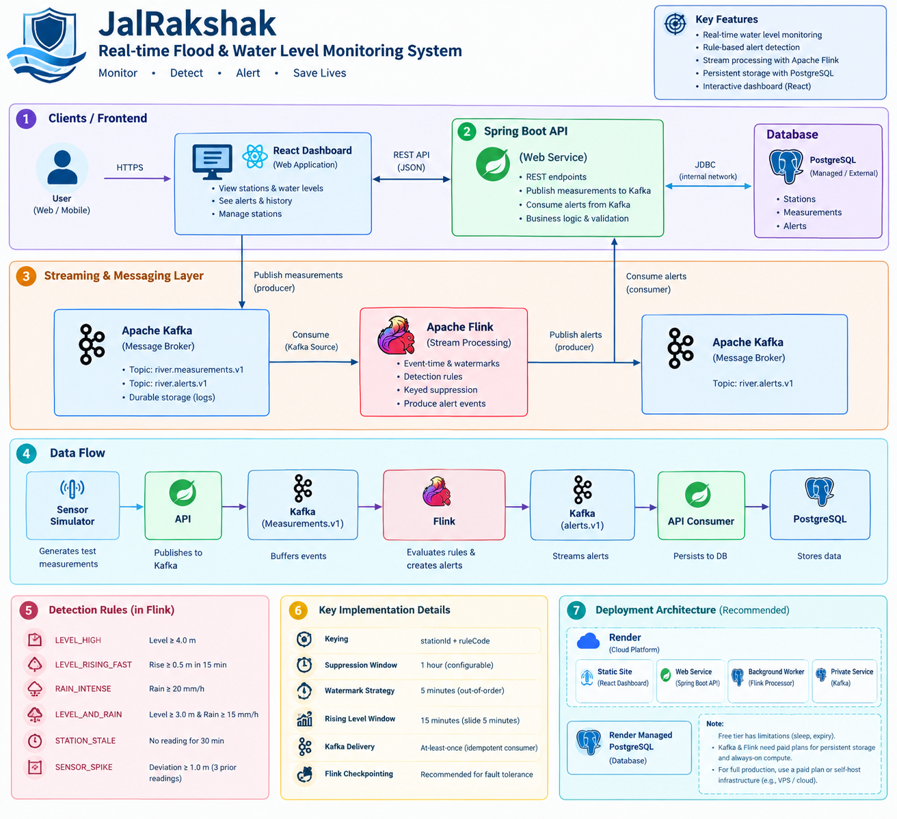
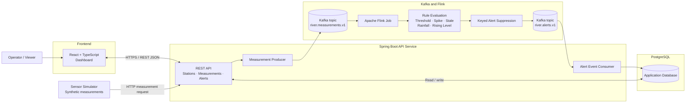

# JalRakshak
### Real-time River Monitoring and Flood-Risk Alerting Prototype

JalRakshak is an event-driven river-monitoring prototype that ingests water-level and rainfall measurements, processes them as a stream, detects configurable conditions, and presents alerts through a web dashboard.

The project demonstrates how a backend API, Apache Kafka, Apache Flink, PostgreSQL, and a React dashboard can work together in a streaming data pipeline.


---

https://github.com/user-attachments/assets/9a5fe357-4b89-47f8-b491-b0413fffe8ec


## Contents

- [Features](#features)
- [Architecture](#architecture)
- [Technology Stack](#technology-stack)
- [Data Flow](#data-flow)
- [Detection Rules](#detection-rules)
- [Kafka Topics and Event Schemas](#kafka-topics-and-event-schemas)
- [Project Structure](#project-structure)
- [Prerequisites](#prerequisites)
- [Local Setup](#local-setup)
- [Demo Scenarios](#demo-scenarios)
- [API Endpoints](#api-endpoints)
- [Configuration](#configuration)
- [Design Decisions](#design-decisions)
- [Testing](#testing)
- [License](#license)

---


## Features

- **Station, measurement, and alert API** built with Spring Boot 3.2 and Java 21, including request validation.
- **Event-driven measurement ingestion** using Apache Kafka and a stable `MeasurementEvent` DTO rather than serializing JPA entities.
- **Stream processing with Apache Flink 1.19.1**, running as a plain Flink job rather than a Spring Boot application.
- **Rule-based detection** for high water levels, rapid rises, intense rainfall, combined level-and-rain conditions, stale stations, and sensor spikes.
- **Event-time processing** with watermarks and a sliding window for rising-level trend detection.
- **Malformed and late-event side outputs** to separate records that cannot be processed normally.
- **Per-station, per-rule alert suppression** to track repeated occurrences of the same condition.
- **PostgreSQL persistence** with Flyway-managed schema migrations; Hibernate schema auto-update is not used.
- **Idempotent alert persistence** designed so repeated deliveries or occurrences do not overwrite an operator’s acknowledge or resolve action.
- **React + TypeScript dashboard** for stations, recent measurements, active alerts, alert history, and acknowledge/resolve actions.
- **Clearly labelled demo scenario controls** for generating synthetic measurements.
- **Local infrastructure through Docker Compose**, including PostgreSQL, single-node Kafka in KRaft mode, and Kafka UI.

---

## Architecture



JalRakshak is organized into five main layers:

1. **Frontend:** React dashboard used to view stations, measurements, and alerts.
2. **API service:** Spring Boot REST API for application operations, measurement ingestion, and alert persistence.
3. **Messaging:** Kafka topics that decouple measurement ingestion from stream processing and alert storage.
4. **Stream processing:** Apache Flink job that evaluates measurements and emits alert events.
5. **Persistence:** PostgreSQL database for application records, with Flyway migrations.

### High-level architecture diagram



### Component responsibilities

| Component | Responsibility |
|---|---|
| Sensor simulator | Generates synthetic measurements and demo scenarios. |
| React dashboard | Displays stations, recent readings, alerts, and operator actions. |
| Spring Boot API | Exposes REST endpoints, validates requests, handles application logic, and connects to Kafka and PostgreSQL. |
| Measurement producer | Publishes stable measurement event DTOs to Kafka. |
| Kafka | Buffers and transports measurement and alert events between services. |
| Flink job | Evaluates streaming measurements against configured rules and creates alert events. |
| Alert consumer | Consumes alert events from Kafka and persists them in PostgreSQL. |
| PostgreSQL | Stores station, measurement, and alert records. |
| Flyway | Applies versioned database migrations at API startup. |

### Core event path

```text
POST /api/v1/measurements
        |
        v
Spring Boot API
  - Validate request
  - Persist measurement
  - Publish MeasurementEvent
        |
        v
Kafka: river.measurements.v1
        |
        v
Apache Flink
  - Deserialize and validate event
  - Assign event timestamps and watermarks
  - Evaluate detection rules
  - Apply keyed alert suppression
        |
        v
Kafka: river.alerts.v1
        |
        v
Spring Boot AlertEventConsumer
  - Consume alert event
  - Persist idempotently by alert ID
        |
        v
PostgreSQL
        |
        v
React dashboard
  - Poll REST API
  - Display stations, readings, and alerts
```

---

## Technology Stack

| Layer | Technology |
|---|---|
| Programming language | Java 21 |
| API framework | Spring Boot 3.2 |
| Stream processing | Apache Flink 1.19.1 |
| Messaging | Apache Kafka |
| Local Kafka mode | Single-node KRaft |
| Database | PostgreSQL 15 |
| Database migrations | Flyway |
| ORM and data access | Spring Data JPA / Hibernate |
| Frontend | React 18, TypeScript, Vite |
| Backend testing | JUnit 5, Mockito |
| Local infrastructure | Docker Compose |
| API documentation | Swagger UI / OpenAPI |

The API service and Flink processor are separate Java applications. Docker Compose is used for local infrastructure; the API, Flink job, and frontend development server are run separately during local development.

---

## Data Flow

### 1. Measurement ingestion

The simulator sends a measurement to the Spring Boot API. The API validates the request, persists the measurement, and publishes a `MeasurementEvent` to Kafka.

The Kafka message uses a dedicated DTO rather than exposing the database entity graph. This keeps the event contract separate from the persistence model.

### 2. Stream processing

The Flink job consumes events from `river.measurements.v1`. It uses the event’s `observedAt` timestamp for event-time processing, assigns watermarks, and evaluates the configured detection rules.

The rule outputs are combined into alert candidates and passed through keyed suppression state.

### 3. Alert publishing

Flink publishes resulting alert events to `river.alerts.v1`. The alert event includes the station, rule, severity, status, event evidence, timestamps, and repeat-tracking information.

### 4. Alert persistence

The API’s `AlertEventConsumer` consumes alert events and persists them in PostgreSQL. Persistence is designed to be idempotent by alert ID and to avoid overwriting an operator’s acknowledge or resolve action when an event is redelivered or repeated.

### 5. Dashboard updates

The React dashboard polls the REST API to retrieve stations, recent measurements, and alerts. It does not connect directly to Kafka or PostgreSQL.

---

## Detection Rules

The current prototype includes the following illustrative rules:

| Rule code | Condition |
|---|---|
| `LEVEL_HIGH` | Water level is at least **4.0 m**. |
| `LEVEL_RISING_FAST` | Water level rises by at least **0.5 m over 15 minutes**. |
| `RAIN_INTENSE` | Rainfall is at least **20 mm/hour**. |
| `LEVEL_AND_RAIN` | Water level is at least **3.0 m** and rainfall is at least **15 mm/hour**. |
| `STATION_STALE` | No reading has been received for **30 minutes**. |
| `SENSOR_SPIKE` | A reading deviates from the preceding one-hour rolling median by at least **1.0 m**, with at least **3 prior valid readings**. |

These thresholds are configurable through the stream processor’s environment variables. Refer to `.env.example` and `docs/architecture.md` for the full list of configuration names and defaults.

> These rules and thresholds are for demonstration only. They are not validated hydrological criteria and must not be treated as official flood-warning logic.

---

## Kafka Topics and Event Schemas

The main Kafka topics are:

| Topic | Event | Producer | Consumer |
|---|---|---|---|
| `river.measurements.v1` | `MeasurementEvent` | Spring Boot API | Flink stream processor |
| `river.alerts.v1` | `AlertEvent` | Flink stream processor | Spring Boot API |

Topic names can be configured through:

- `KAFKA_TOPIC_MEASUREMENTS`
- `KAFKA_TOPIC_ALERTS`

### MeasurementEvent

The measurement event is the wire-format contract used to send readings from the API to the stream processor.

| Field | Description |
|---|---|
| `eventId` | Unique measurement event identifier; used for measurement idempotency. |
| `stationId` | Identifier of the station that produced the measurement. |
| `observedAt` | Timestamp reported for the measurement; used as event time. |
| `waterLevelM` | Water level in metres. |
| `rainfallMmPerHour` | Rainfall rate in millimetres per hour. |
| `flowRateM3S` | Flow rate in cubic metres per second. |
| `schemaVersion` | Event schema version. |

### AlertEvent

The alert event is produced by Flink and consumed by the API.

| Field | Description |
|---|---|
| `id` | Alert identifier used as the persistence idempotency key. |
| `stationId` | Station associated with the alert. |
| `ruleCode` | Detection rule that generated the alert. |
| `severity` | Alert severity. |
| `status` | Alert status. |
| `title` | Short alert title. |
| `reason` | Human-readable explanation of the condition. |
| `evidence` | Structured information supporting the alert. |
| `triggeredAt` | Time the alert was first triggered. |
| `lastOccurredAt` | Time of the most recent occurrence represented by the alert. |
| `repeatCount` | Number of occurrences tracked for the alert. |

See `docs/architecture.md` for the full schema details and processing semantics.

---

## Project Structure

The repository is organized into infrastructure, backend modules, and frontend code.

```text
jalrakshak/
├── infra/
│   └── docker-compose.yml
├── backend/
│   ├── pom.xml
│   ├── shared/
│   ├── api-service/
│   └── stream-processor/
├── frontend/
├── docs/
│   ├── architecture.md
│   ├── api.md
│   └── demo-script.md
└── README.md
```

The backend Maven reactor builds the modules in dependency order:

1. `shared`
2. `api-service`
3. `stream-processor`

The `shared` module contains common event contracts and related shared code.

---

## Prerequisites

Install the following tools before running the project:

- Docker
- Docker Compose
- Java 21 JDK
- Maven 3.8 or later
- Node.js 18 or later
- npm

Verify the installed versions:

```bash
java -version
mvn -version
node --version
npm --version
docker --version
docker compose version
```

---

## Local Setup

### 1. Start infrastructure

From the repository root:

```bash
cd jalrakshak/infra
docker-compose up -d
```

Check the infrastructure containers:

```bash
docker-compose ps
```

Wait for PostgreSQL and Kafka to report healthy before starting the applications.

The local setup uses a single-node Kafka broker in KRaft mode. It does not require a separate ZooKeeper container.

### 2. Build the backend

From the repository root:

```bash
cd jalrakshak/backend
mvn install -DskipTests
```

This builds and installs the shared module before building the API and stream processor against it.

### 3. Configure environment variables

Review `.env.example` for the database, Kafka, API, CORS, and stream processor settings.

Configure the environment variables required by each process before launching it. The local defaults are intended to work with the Docker Compose infrastructure, including Kafka at `localhost:9092`.

Do not commit real credentials or secrets to the repository.

### 4. Run the API service

In a terminal:

```bash
cd jalrakshak/backend/api-service
mvn spring-boot:run
```

The API is available at:

- API base URL: `http://localhost:9000`
- Swagger UI: `http://localhost:9000/swagger-ui.html`

The API applies Flyway migrations at startup.

### 5. Run the Flink stream processor

Open a separate terminal:

```bash
cd jalrakshak/backend
mvn -pl stream-processor -am package -DskipTests

cd stream-processor
java -jar target/stream-processor-0.0.1-SNAPSHOT.jar
```

The processor is a separate application and must be running for measurement events to be evaluated and alerts to be generated.

The shaded JAR manifest includes the Java module-system flags needed by Flink on Java 17 and later. If you encounter an `InaccessibleObjectException` mentioning `java.util`, run the provided `run.sh` script from the `stream-processor` directory instead:

```bash
./run.sh
```

### 6. Run the frontend

Open another terminal:

```bash
cd jalrakshak/frontend
npm install
npm run dev
```

The dashboard is available at:

```text
http://localhost:3000
```

The frontend reads the API base URL from `VITE_API_BASE_URL`. The default is:

```text
http://localhost:9000/api/v1
```

If the API is running at another address, set `VITE_API_BASE_URL` in a `.env` file inside `frontend/`.

### 7. Register a station and try the demo

At least one station must be registered before running the demo scenarios. Use the dashboard’s **+ Add station** form or follow `docs/demo-script.md`.

Once the API is running and a station exists, trigger one of the demo scenarios.

---

## Demo Scenarios

The simulator provides scenario endpoints that generate synthetic measurements.

| Scenario | Endpoint |
|---|---|
| Normal readings | `POST /api/v1/simulator/scenarios/normal` |
| Rising water level | `POST /api/v1/simulator/scenarios/rising-level` |
| Rainfall | `POST /api/v1/simulator/scenarios/rainfall` |
| Sensor spike | `POST /api/v1/simulator/scenarios/spike` |
| Station offline | `POST /api/v1/simulator/scenarios/offline` |
| Duplicate event | `POST /api/v1/simulator/scenarios/duplicate` |
| Delayed event | `POST /api/v1/simulator/scenarios/delayed` |

Example:

```bash
curl -X POST \
  http://localhost:9000/api/v1/simulator/scenarios/rising-level
```

The simulator returns a response indicating that the scenario has started. Measurements and alerts are processed asynchronously, so allow time for the events to travel through Kafka and Flink and appear in the dashboard.

**Note:** The `offline` scenario is currently a no-op by design. It relies on time passing without new readings for a station to eventually become stale; it does not create an immediate observable event.

All scenario data is synthetic and should be identified as demo data.

---

## API Endpoints

The API provides the following endpoint groups. See `docs/api.md` for request and response examples.

### Stations

| Method | Endpoint | Purpose |
|---|---|---|
| `GET` | `/api/v1/stations` | List stations. |
| `POST` | `/api/v1/stations` | Create a station. |
| `GET` | `/api/v1/stations/{id}` | Retrieve a station. |

### Measurements

| Method | Endpoint | Purpose |
|---|---|---|
| `POST` | `/api/v1/measurements` | Submit a measurement. |
| `GET` | `/api/v1/measurements` | List measurements. |
| `GET` | `/api/v1/measurements/station/{stationId}` | List measurements for a station. |

### Alerts

| Method | Endpoint | Purpose |
|---|---|---|
| `GET` | `/api/v1/alerts` | List alerts. |
| `GET` | `/api/v1/alerts/{id}` | Retrieve an alert. |
| `GET` | `/api/v1/alerts/station/{stationId}` | List alerts for a station. |
| `POST` | `/api/v1/alerts/{id}/acknowledge` | Acknowledge an alert. |
| `POST` | `/api/v1/alerts/{id}/resolve` | Resolve an alert. |

### Simulator and health

| Method | Endpoint | Purpose |
|---|---|---|
| `POST` | `/api/v1/simulator/scenarios/{name}` | Start a simulator scenario. |
| `GET` | `/api/v1/health` | Check API health. |

---

## Configuration

The application is configured through environment variables.

The `.env.example` file documents the available settings, including:

- Database connection details
- Kafka bootstrap server
- Kafka topic names
- API server port
- CORS origin configuration
- Stream processor consumer group
- Detection rule thresholds
- Event-time window and watermark settings
- Alert suppression window

The stream processor uses `localhost:9092` by default for local development, matching the Docker Compose Kafka setup.

Use the documented variable names from `.env.example` when configuring the services. Avoid hardcoding deployment-specific addresses or credentials in source code.

---

## Design Decisions

### Dedicated event DTOs

The API publishes a stable `MeasurementEvent` DTO rather than serializing a JPA entity. This keeps the Kafka event contract independent of database implementation details and prevents accidental publication of an entity relationship graph.

### Measurement idempotency

`eventId` is the idempotency key for measurements. If the API receives the same event ID again, it does not persist or publish that duplicate measurement a second time.

The simulator’s scenario generators were updated to include a per-run timestamp in generated event IDs. This prevents a second run of a scenario from reusing the same IDs and being silently treated as duplicate input.

### Event time and ingestion time

The system distinguishes between:

- `observedAt`: the timestamp reported by the sensor, used as event time in stream processing.
- `receivedAt`: the time the API ingested the measurement.

This distinction supports event-time processing even when readings arrive later than they were observed.

### Alert suppression and repeat tracking

Alert suppression is keyed by station and rule code:

```text
stationId + "|" + ruleCode
```

Within the configured suppression window, repeated occurrences are tracked through `repeatCount` and `lastOccurredAt`, rather than creating a new alert row for every occurrence.

Alert persistence uses the alert ID as its idempotency key. Redelivery or repeat occurrences are intended not to overwrite an operator’s acknowledge or resolve action.

### Database migrations

Flyway manages database schema changes. Hibernate `ddl-auto=update` is not used, so schema evolution is controlled through migration files.

### Separate stream processor

The Flink job is a plain Flink application, not a Spring Boot service. It runs independently from the API and communicates with it through Kafka topics.

---

## Testing

Run the backend test suite from the backend directory:

```bash
cd jalrakshak/backend
mvn test
```

The project includes tests covering:

- Shared event serialization and deserialization round-tripping.
- API measurement-to-event mapping, ensuring the JPA entity graph is not published.
- Alert persistence idempotency, including redelivery and repeat-occurrence behavior.
- Pure stream-processing rule engines:
  - `ThresholdRules`
  - `SpikeRuleEngine`
  - `RisingLevelRuleEngine`
- Rule boundary and warm-up cases.
- Kafka deserializer handling of malformed records.


---


## Documentation

Additional project documentation:

- `docs/architecture.md` — full data-flow diagram, topic and schema details, thresholds, window configuration, suppression semantics, and Flink runtime notes.
- `docs/api.md` — API request and response examples.
- `docs/demo-script.md` — station setup and demo walkthrough.
- `.env.example` — documented configuration variables and defaults.

---

## License
JalRakshak currently uses simulated data and illustrative thresholds. It has not been validated for operational flood forecasting or public-safety decisions. Do not use it to make emergency or public-safety decisions.
Educational and demonstration purposes only.
